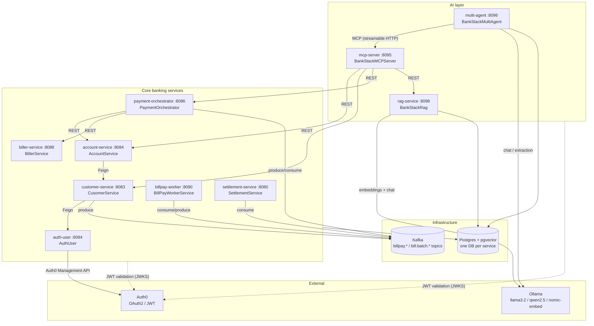

# BankStackAI

A microservices banking platform with an AI layer on top: core banking services
(customers, accounts, bill pay, settlement) built with Spring Boot + Kafka + Postgres,
plus an MCP tool server, a RAG service, and a multi-agent orchestrator built with
Spring AI + Ollama.

📖 **[Browse the API reference](https://jclin0311.github.io/BankStackAI/)** — every service's
OpenAPI spec, no setup required.

🔬 **[Runtime walkthrough](https://jclin0311.github.io/BankStackAI/demo.html)** — a real bill
payment and a real AI-agent request traced hop by hop through the running cluster, with the
actual HTTP payloads, Kafka messages, database rows and audit lines at every step.

## Architecture



**Bill-pay flow:** payment-orchestrator receives a payment request, emits
`billpay.requested` → billpay-worker enqueues and batches → `bill.batch.ready` →
orchestrator submits the batch to biller-service → `bill.batch.submitted` →
settlement-service settles. Retries / DLQ ride on `bill.batch.retry|resubmit|dlq`.

**AI flow:** multi-agent takes a natural-language request, uses Ollama to reason and
extract intents, calls tools exposed by mcp-server over MCP, which fans out to the
core services; rag-service answers knowledge questions with pgvector hybrid search.

## Services

| Service | Module | Port | Swagger UI |
|---|---|---|---|
| auth-user | AuthUser | 8094 | http://localhost:8094/swagger-ui.html |
| customer-service | CusomerService | 8083 | http://localhost:8083/swagger-ui.html |
| account-service | AccountService | 8084 | http://localhost:8084/swagger-ui.html |
| payment-orchestrator | PaymentOrchestrator | 8086 | http://localhost:8086/swagger-ui.html |
| biller-service | BillerService | 8088 | http://localhost:8088/swagger-ui.html |
| billpay-worker | BillPayWorkerService | 8090 | http://localhost:8090/swagger-ui.html |
| settlement-service | SettlementService | 8080 | http://localhost:8080/swagger-ui.html |
| mcp-server | BankStackMCPServer | 8095 | http://localhost:8095/swagger-ui.html |
| multi-agent | BankStackMultiAgent | 8096 | http://localhost:8096/swagger-ui.html |
| rag-service | BankStackRag | 8098 | http://localhost:8098/swagger-ui.html |

Shared libraries: `commons-dto`, `commons-security` (OAuth2 resource-server setup),
`commons-observability`. `BankStackEval` is an offline evaluation harness;
`SpringAiOllamaPOC` is a scratch POC — neither is deployed.

## Local development

Prerequisites: JDK 17, Maven, Docker (OrbStack or Docker Desktop),
[direnv](https://direnv.net) (loads `.env` with Auth0 credentials), and
[Ollama](https://ollama.com) with `llama3.2`, `qwen2.5:1.5b`, `nomic-embed-text`
pulled if you want the AI services to answer.

```bash
# 1. Infrastructure: Kafka + Postgres (pgvector) + kafka-ui on :8079
docker compose up -d

# 2. Build everything (shared libs first — order matters)
./build-all.sh

# 3. Run any service
cd AccountService && mvn spring-boot:run
```

Tests (Postgres must be running for the JPA context tests):

```bash
for m in */; do (cd "$m" && [ -f pom.xml ] && mvn test); done
```

> **Note:** VS Code's Java extension used to overwrite Maven's `target/classes`
> with its own (broken) builds, which made `mvn test` fail randomly with
> "No qualifying bean of type …Mapper". Autobuild is disabled in
> `.vscode/settings.json` — leave it off, or run `mvn clean test`.

## Docker & Kubernetes

Each service has a runtime-only Dockerfile that copies the jar built by Maven.

```bash
./build-all.sh          # build jars
./build-images.sh       # docker build bankstack/<service>:local for all 10 services
```

Deploy to a local cluster (OrbStack: `orb start k8s`; also works on minikube/k3s —
build or load the images into the cluster's runtime first):

```bash
kubectl apply -k k8s/            # namespace, Postgres, Kafka (KRaft), 10 services
./k8s/create-auth0-secret.sh     # bankstack-auth0 secret from .env (auth-user needs it)
kubectl -n bankstack get pods
```

Details:

- `k8s/infra/postgres.yaml` runs pgvector Postgres and creates the per-service
  databases on first start (mirrors `postgres-init.sql`).
- `k8s/infra/kafka.yaml` runs single-node Kafka in KRaft mode (no ZooKeeper).
- The AI services reach Ollama on the host via `host.docker.internal:11434`.
- Try it: `kubectl -n bankstack port-forward svc/account-service 8084:8084`,
  then open http://localhost:8084/swagger-ui.html.

## CI/CD

One workflow: [.github/workflows/ci.yml](.github/workflows/ci.yml)

1. **build-test** — builds all modules in dependency order and runs `mvn test`
   for every module against a Postgres service container (every push / PR).
2. **images** — on `main` pushes, builds the 10 service images and pushes them to
   GHCR as `ghcr.io/<owner>/bankstack/<service>:<sha>` and `:latest`.
3. **deploy** — applies `k8s/` with the freshly pushed image tags via kustomize.
   Runs only if a `KUBE_CONFIG` repo secret (base64-free kubeconfig content) is
   configured; otherwise it is skipped — deploy to the local OrbStack cluster
   from your machine with the commands above.
